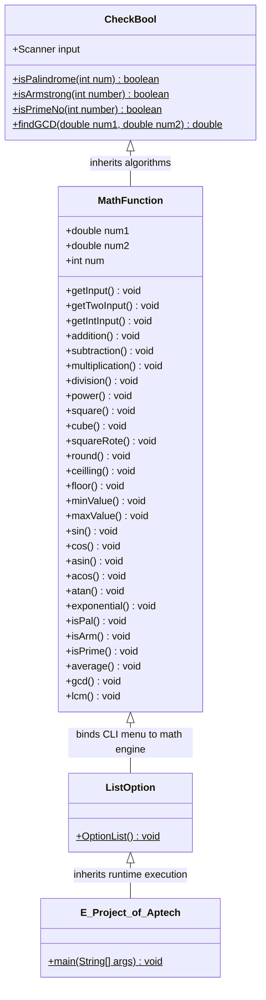

<div align="center">

# 🧮 Java Console Scientific & Number Theory Calculator
### Object-Oriented Multi-Function Computational Suite & Number Theory Engine

[-ED8B00?logo=openjdk&logoColor=white)](#-tech-stack--dependencies)
[](#-oop-architecture--class-hierarchy)
[](#-comprehensive-25-function-matrix)
[](#-compilation--execution)
[](#-compilation--execution)
[](LICENSE)

**English** | [العربية](#-نظرة-عامة-باللغة-العربية)

</div>

---

## 🌟 Overview

The **Java Console-Based Calculator** is an enterprise-grade terminal mathematical suite developed as an advanced software project for the **Aptech Engineering Curriculum**. Moving far beyond simplistic arithmetic calculators, this application implements **25 distinct mathematical, statistical, trigonometric, and number-theory algorithms** backed by an object-oriented inheritance architecture.

Engineered with bulletproof input-validation loops, the application handles non-numeric exceptions gracefully, preventing terminal crashes during live user input sessions.

---

## 🏗️ OOP Architecture & Class Hierarchy

The project is structured around a multi-tier object-oriented inheritance pipeline separating boolean algorithmic logic, mathematical computation, CLI presentation, and the launcher entrypoint:



---

## 📊 Comprehensive 25-Function Matrix

| Category | Option | Function | Mathematical Description |
|---|:---:|---|---|
| **Basic Arithmetic** | `1` | **Addition** | $x + y$ |
| | `2` | **Subtraction** | $x - y$ |
| | `3` | **Multiplication** | $x \times y$ |
| | `4` | **Division** | $x / y$ (formatted to 2 decimal places) |
| **Powers & Roots** | `5` | **Power** | $x^y$ ($\text{pow}(x, y)$) |
| | `6` | **Square** | $x^2$ |
| | `7` | **Cube** | $x^3$ |
| | `8` | **Square Root** | $\sqrt{x}$ |
| **Rounding & Truncation** | `9` | **Round** | Nearest integer ($\text{round}(x)$) |
| | `10` | **Ceiling** | Smallest integer $\ge x$ ($\lceil x \rceil$) |
| | `11` | **Floor** | Greatest integer $\le x$ ($\lfloor x \rfloor$) |
| **Extrema & Statistics** | `12` | **Min Value** | Evaluates minimum across dynamic array of $N$ user inputs |
| | `13` | **Max Value** | Evaluates maximum across dynamic array of $N$ user inputs |
| | `23` | **Average** | Arithmetic mean: $\frac{1}{N} \sum_{i=1}^N x_i$ |
| **Trigonometry** | `14` | **Sine** | $\sin(x)$ |
| | `15` | **Cosine** | $\cos(x)$ |
| | `16` | **Arcsine** | $\arcsin(x)$ |
| | `17` | **Arccosine** | $\arccos(x)$ |
| | `18` | **Arctangent** | $\arctan(x)$ |
| **Exponential** | `19` | **Exponential** | $e^x$ ($\exp(x)$) |
| **Number Theory** | `20` | **Palindrome** | Tests if integer reads identically forward and backwards |
| | `21` | **Armstrong Number** | Tests if sum of $k$-th powers of digits equals original number |
| | `22` | **Prime Number** | Divisibility test verifying primality $\forall d \in [2, \sqrt{N}]$ |
| | `24` | **GCD** | Greatest Common Divisor via Euclidean Algorithm: $\gcd(a, b)$ |
| | `25` | **LCM** | Least Common Multiple: $\text{lcm}(a, b) = \frac{\|a \cdot b\|}{\gcd(a, b)}$ |
| **System** | `0` | **Exit** | Terminates interactive program loop |

---

## 🖥️ Interactive Console Workflow & Sample Run

When executed, the program presents an interactive CLI dashboard with instant validation:

```text
Welcome to Java Console Based Caluculator *__* 
Choose Number to Perform  a Function -------------  or Zero To Exit 
 1 --> Addition 
 2 --> Subtraction 
 3 --> Multiplication 
 4 --> Division 
 5 --> Power 
 6 --> Square 
 7 --> Cube 
 8 --> Square root 
 9 --> Round 
 10 --> Ceiling 
 11 --> Floor 
 12 --> Min Value 
 13 --> Max Value 
 14 --> Sin 
 15 --> Cos 
 16 --> Asin 
 17 --> Acos 
 18 --> Atan 
 19 --> Exponential 
 20 --> Palindrome, 
 21 --> Armstrong number 
 22 --> Prime number 
 23 --> Average 
 24 --> GCD 
 25 --> LCM 
 0 --> Exit 

> 24
Enter two numbers to find the GCD:
Enter First Number: 48
Enter Second Number: 18
The greatest common divisor of 48.0 and 18.0 is: 6.0
```

---

## 📁 Project Directory Layout

```text
Java_Console_based_Calculator/
├── src/
│   └── e_project_of_aptech/
│       ├── CheckBool.java           # Number theory predicates (Palindrome, Armstrong, Prime, GCD)
│       ├── MathFunction.java        # Core mathematical & trigonometric implementation
│       ├── ListOption.java          # CLI menu rendering & validated input ingestion loop
│       └── E_Project_of_Aptech.java # Application launcher containing main(String[] args)
├── nbproject/                       # NetBeans project configuration & build properties
├── build.xml                        # Apache Ant build script
├── manifest.mf                      # JAR manifest with Main-Class definition
└── README.md
```

---

## 🚀 Compilation & Execution

You can compile and run the calculator using either standard Java CLI tools or Apache Ant.

### Option A: Standard Java CLI (Zero Dependencies)

1. **Clone the Repository**:
   ```bash
   git clone https://github.com/Brosfeer/Java_Console_based_Calculator.git
   cd Java_Console_based_Calculator
   ```

2. **Compile the Sources**:
   ```bash
   mkdir -p bin
   javac -d bin src/e_project_of_aptech/*.java
   ```

3. **Run the Application**:
   ```bash
   java -cp bin e_project_of_aptech.E_Project_of_Aptech
   ```

### Option B: Apache Ant

If you have Apache Ant installed:
```bash
# Compile and build the project
ant compile

# Execute directly from Ant
ant run

# Package into a standalone executable JAR
ant jar
java -jar dist/Java_Console_based_Calculator.jar
```

---

## 🇸🇦 نظرة عامة باللغة العربية

برنامج **الآلة الحاسبة العلمية ونظرية الأعداد (Java Console Calculator)** هو مشروع برمجي متقدم مبني بلغة جافا (Java) ضمن متطلبات مشروع Aptech البرمجي. يتجاوز هذا البرنامج حدود الآلات الحاسبة البسيطة ليقدم **25 دالة رياضية وخوارزمية وخوارزميات في نظرية الأعداد** ضمن معمارية برمجية كائنية التوجه (OOP) مبنية على الوراثة النظيفة (Inheritance).

### أبرز الميزات والخوارزميات:
1. **العمليات الحسابية والأسس**: الجمع، الطرح، الضرب، القسمة مع التقريب لخانة عشرية، والأسس، المربعات، والمكعبات والجذور التربيعية.
2. **علم حساب المثلثات واللوغاريتمات**: حساب دوال الجيب وجيب التمام والظل والدوال العكسية ($\sin, \cos, \arcsin, \arccos, \arctan$) بالإضافة للدوال الأسية ($e^x$).
3. **خوارزميات نظرية الأعداد (Number Theory)**:
   - فحص الأعداد المتناظرة (Palindrome Numbers).
   - فحص أرقام آرمسترونغ (Armstrong Numbers).
   - خوارزمية اختبار الأعداد الأولية (Prime Number Checker).
   - حساب القاسم المشترك الأكبر (GCD) عبر خوارزمية إقليدس.
   - حساب المضاعف المشترك الأصغر (LCM).
4. **المعالجة الآمنة للمدخلات (Exception-Safe Input)**: حماية تامة للطرفية من الانهيار عند إدخال حروف بدلاً من الأرقام، مع إعادة التوجيه الفوري لطلب رقم صحيح.
5. **معمارية OOP نقية**: فصل منطق الشروط المنطقية (`CheckBool`) عن العمليات الرياضية (`MathFunction`) وعن واجهة الطرفية (`ListOption`).

---

## 👨‍💻 Author & Engineering Leadership

Engineered with architectural discipline by **Sharaf** ([@Brosfeer](https://github.com/Brosfeer)) — Principal Mobile & Systems Architect & Founder of **SayaSky Studio**.

- **GitHub**: [@Brosfeer](https://github.com/Brosfeer)
- **Studio**: **SayaSky Studio** ([Google Play](https://play.google.com/store/apps/details?id=com.sayasky.kiddyzonetown&hl=ar))
- **Specialization**: Mobile Systems, Real-Time Telemetry & Clean Architecture

---

## 📄 License

Distributed under the **MIT License**. See [LICENSE](LICENSE) for details.
